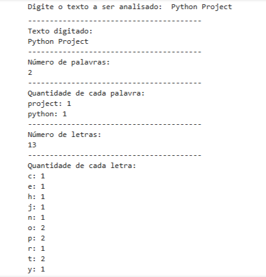

# 🧾 Analisador Textual

Projeto em Python que realiza uma análise básica de um texto digitado pelo usuário.

## 💡 Objetivo

Realizar uma análise textual simples, retornando as seguintes informações úteis:
- O texto original inserido
- O número total de palavras e letras
- A frequência de cada palavra e letra

## ✏️ Sobre o Projeto

Este foi um dos meus primeiros códigos desenvolvidos, com o objetivo de praticar conceitos essenciais de programação em Python.
Conceitos e técnicas abordadas neste código:
- Entrada de dados: `input()`
- Manipulação de strings: `.lower()`, `.replace()`, `.split()`, `.join()`
- Estrutura de repetição: `for`
- Contagem e organização de elementos: `len()`, `.items()`, `sorted()`
- Contagem específica de elementos: `collections.Counter`
- Formatação de saída: `f-strings`

## 🖼️ Exemplo de execução

---

⚠️ **Observações:**
- Optei por não retirar os acentos do texto inserido para não alterar o sentido de algumas palavras. Letras acentuadas são tratadas como caracteres diferentes dos mesmos sem acento. Na contagem e na ordenação, elas aparecem após a letra "z" do alfabeto, seguindo a ordem padrão do Python com a função `sorted()`.
- Também não utilizei bibliotecas externas como `locale`, pois ainda não estou familiarizada com as configurações adicionais que elas exigem. Além disso, o foco deste projeto é demonstrar o domínio dos recursos que aprendi até o momento.