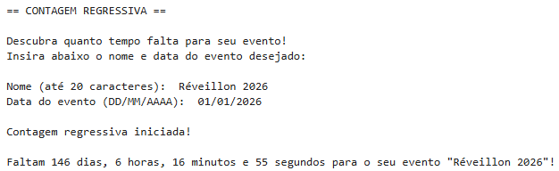

# ⏳ Contagem Regressiva para Evento

Projeto em Python que calcula o tempo restante até a data informada pelo usuário.

## 💡 Objetivo

Exibir quanto tempo falta para uma data futura informada pelo usuário, em dias, horas, minutos e segundos, atualizando a contagem regressiva em tempo real no terminal.

## ✏️ Sobre o Projeto

Projeto simples desenvolvido com o objetivo de reforçar o aprendizado de conceitos essenciais de Python, especialmente relacionados a datas, horários e atualização contínua em tempo real.
Conceitos e técnicas abordadas neste código:

- Entrada de dados: `input()`
- Validação de entrada: `while`, `if`, `else`, `continue`, `break`
- Tratamento de erros: `try`-`except`
- Manipulação de datas e horas: `datetime`, `timedelta`
- Operação matemática por meio de função: `divmod()`
- Atualização por segundo: `while True` + `time.sleep(1)`
- Atualização dinâmica de linha no terminal: `print(..., end='\r')`
- Formatação de saída: `f-strings`

## 🖼️ Exemplo de Execução

O terminal exibe a contagem regressiva atualizada a cada segundo, refletindo o tempo que falta para o evento:

---

#### ⚠️ Observações:

- O objeto `tempo_restante` utilizado no código é do tipo `timedelta`, que possui apenas os atributos `.days`, `.seconds` e `.microseconds` (ou seja, não existe um atributo que calcule automaticamente "hours" ou "minutes"). Por isso, para obter as horas, minutos e segundos restantes, foi necessário usar `tempo_restante.days` e calcular o restante a partir de `tempo_restante.seconds` com a função `divmod()`.

- **Possíveis melhorias futuras**:
  - Permitir que o usuário insira também o **horário** do evento (e não apenas a data);  
  - Ajustar o uso de **singular/plural** nas palavras exibidas (exemplo: "1 minuto" ao invés de "1 minutos");  
  - Adicionar a opção de o usuário **cancelar ou sair** durante a entrada de dados (exemplo: digitando "sair").