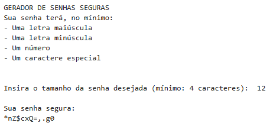

# 🔐 Gerador de Senhas Seguras

Projeto em Python que gera senhas aleatórias criptograficamente seguras.

## 💡 Objetivo

Gerar senhas seguras.  
A senha terá a quantidade de caracteres estipulada pelo usuário e será composta por, pelo menos:  
- Uma letra **maiúscula**  
- Uma letra **minúscula**  
- Um **número**  
- Um **caractere especial**  
O resultado final será exibido no terminal.

## ✏️ Sobre o Projeto

Este código foi desenvolvido com o objetivo de praticar e demonstrar conceitos em Python aprendidos até o momento.
Conceitos e técnicas abordadas neste código:  
- Módulos: `secrets` (para geração de números aleatórios criptograficamente seguros)  
  e `string` (para acessar listas de caracteres)  
- Estruturas de repetição: `while`, `for`  
- Entrada e tratamento de dados: `input()`, `int()`  
- Condições e operadores lógicos: `if`, `any()`, `and`
- Tratamento de erros com `try-except`  
- Manipulação de strings com `.join()`  
- Formatação de saída com `f-strings`  
- Práticas de organização e legibilidade

## 🖼️ Exemplo de execução

---

🧠 **Possíveis aprimoramentos futuros:**
- Permitir que o usuário selecione os grupos de caracteres que deseja incluir  
- Exibir o nível de segurança estimado da senha  
- Gerar múltiplas senhas de uma vez  
- Salvar as senhas geradas em um arquivo `.txt`